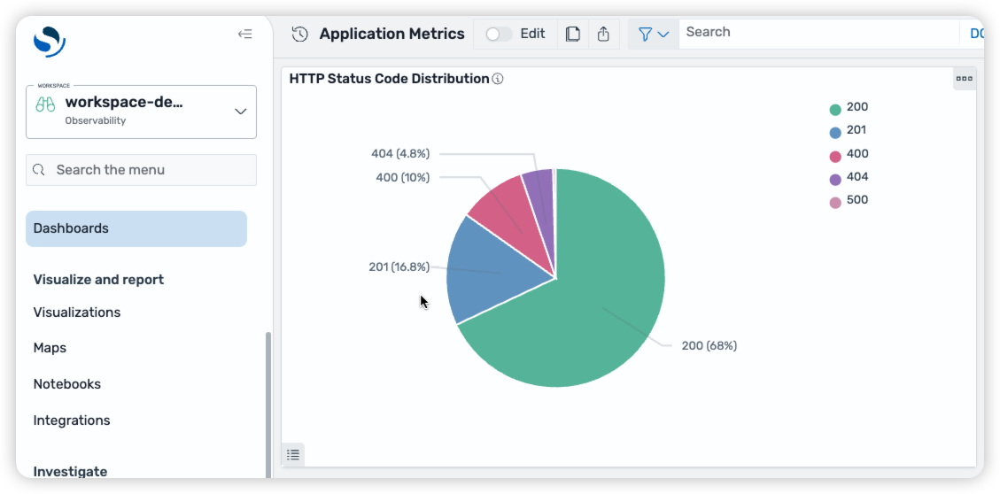

# Automated OpenSearch UI Dashboard Deployment with AWS CDK

This sample demonstrates how to automate Amazon OpenSearch UI workspace and dashboard creation using AWS CDK, AWS Lambda, and the OpenSearch Dashboards Saved Objects API.

## Architecture

The solution automatically:
1. Creates an OpenSearch Domain and OpenSearch UI Application
2. Deploys a Lambda function that runs during CloudFormation stack creation
3. Generates and ingests sample metrics data into the OpenSearch domain
4. Creates a workspace in OpenSearch UI with proper data source configuration
5. Builds index patterns, visualizations, and dashboards programmatically

### What Gets Created

- **OpenSearch Domain**: Single-node r6g.large.search instance with OpenSearch 2.11
- **OpenSearch UI Application**: Managed UI for OpenSearch with IAM-based authentication
- **Lambda Function**: Python 3.11 function for automated workspace and dashboard setup
- **Sample Dashboard**: Pie chart visualization showing HTTP status code distribution from generated API metrics

## Prerequisites

- AWS Account with appropriate IAM permissions
- [AWS CLI](https://aws.amazon.com/cli/) installed and configured
- [Node.js](https://nodejs.org/) 18.x or later (for CDK)
- [Python](https://www.python.org/) 3.11 or later (for Lambda development)
- [AWS CDK](https://aws.amazon.com/cdk/) v2.110.0 or later

## Project Structure

```
sample-automate-opensearch-ui-dashboards-deployment/
├── README.md
├── LICENSE
├── CODE_OF_CONDUCT.md
├── CONTRIBUTING.md
├── cdk/
│   ├── bin/
│   │   └── app.ts                    # CDK app entry point
│   ├── lib/
│   │   └── dashboard-stack.ts        # Main CDK stack definition
│   ├── package.json                  # CDK dependencies
│   ├── tsconfig.json
│   └── cdk.json
└── lambda/
    ├── dashboard_automation.py       # Lambda handler for dashboard setup
    ├── sigv4_signer.py              # SigV4 signing utility for API requests
    └── requirements.txt              # Python dependencies
```

## Quick Start

### 1. Clone and Setup

```bash
# Clone the repository
git clone https://github.com/aws-samples/sample-automate-opensearch-ui-dashboards-deployment.git
cd sample-automate-opensearch-ui-dashboards-deployment

# Install CDK dependencies
cd cdk
npm install
```

### 2. Bootstrap CDK (First Time Only)

If this is your first CDK deployment in this AWS account/region:

```bash
npx cdk bootstrap
```

This creates an S3 bucket and IAM roles needed for CDK deployments. You only need to do this once per account/region.

To check if already bootstrapped:
```bash
aws cloudformation describe-stacks --stack-name CDKToolkit
```

### 3. Configure Your Deployment (Optional)

The stack uses a default admin user ARN. To specify your own:

```bash
npx cdk deploy -c masterUserArn=arn:aws:iam::123456789012:role/YourAdminRole
```

The stack also has the infrastructure to deploy the OpenSearch Domain in a VPC. To enable it:

```bash
npx cdk deploy -c enableVpc=true
```

To specify your own admin user ARN and enable a VPC:

```bash
npx cdk deploy -c masterUserArn=arn:aws:iam::123456789012:role/YourAdminRole -c enableVpc=true
```

To preview what will be deployed:
```bash
npx cdk synth  # View CloudFormation template
npx cdk diff   # View resource changes
npx cdk list   # List available stacks
```

### 4. Deploy the Stack

Deploy the stack (takes approximately 20-25 minutes):

```bash
npx cdk deploy --require-approval never
```

The deployment will:
- Create an OpenSearch domain (~15-20 minutes)
- Create an OpenSearch UI Application
- Deploy the Lambda function with proper IAM permissions
- Automatically trigger the Lambda to create workspace and dashboard

The stack outputs will include:
- **OpenSearchUIEndpoint**: URL to access the OpenSearch UI
- **OpenSearchDomainEndpoint**: OpenSearch domain endpoint for API access
- **WorkspaceId**: The created workspace ID

## Verification and Testing

### Access the Dashboard

1. Get your OpenSearch UI endpoint from stack outputs or from your AWS console

2. Open the URL in your browser

3. Navigate to the **workspace-demo** workspace (visible in the workspace selector)

4. Open the **Application Metrics** dashboard

5. You should see a pie chart showing the distribution of HTTP status codes (200, 201, 400, 404, 500) from the generated sample data



*Figure: The dashboard shows HTTP status code distribution with 200 (68%), 201 (16.8%), 400 (10%), 404 (4.8%), and 500 responses from the automatically generated sample metrics data.*
